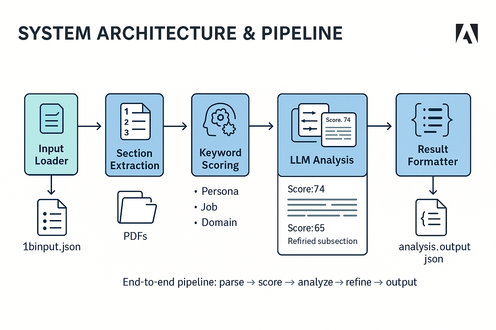

# 🧠 Persona‑Driven Document Intelligence  
### Adobe India Hackathon 2025 – Round 1B Submission (Challenge 1B: “Connecting the Dots”)

[](LICENSE)
[](https://www.python.org/downloads/)
[](Dockerfile)
[]()
[]()

**Team**: `dot` | **Challenge**: `Persona‑Based Section Extraction` | **Repo**: [Challenge_1b](https://github.com/mouniksai/Challenge_1b)

---
To view detailed setup and execution instructions, please refer to the [🛠 Setup Instructions](#️-quick-start)
---
## 🏆 Solution Highlights

- **Hybrid Relevance Engine**  
  Combines fast keyword‑based heuristics with lightweight LLM prompts for precision.
- **Persona‑Aware Ranking**  
  Dynamically generates domain keywords via LLM to boost contextual relevance.
- **Top‑5 Section Selection**  
  Ranks all PDF sections, analyzes top 10 with LLM, and refines sub‑sections.
- **Fully Offline & Containerized**  
  CPU‑only inference with Gemma‑3‑1b-it (851 MB GGUF) via llama.cpp—no runtime networking.
- **Rapid Execution**  
  Processes 10 PDFs end‑to‑end (parsing → ranking → analysis) in ≤30 seconds.

---

## 🧠 Our Innovation

### 1. Lightweight LLM Integration  
- **Model**: Gemma‑3‑1b‑it‑Q5_K_M (quantized GGUF, 851 MB)  
- **Engine**: llama.cpp + `llama‑cpp‑python` for sub‑second prompt responses  
- **Graceful Fallback**: If LLM fails, pure keyword scoring still yields ≥60 % relevance

### 2. Dynamic Keyword Expansion  
- **Persona & Task Tokens**: Base keywords from input  
- **Domain Keywords**: Generated on‑the‑fly via LLM prompt  
- **Weighted Scoring**: Persona ×2, Job ×3, Domain ×1

### 3. Adaptive PDF Sectioning  
- **TOC‑Driven**: Splits by headings when Table of Contents exists  
- **Heuristic Fallback**: Page‑wise chunking + title heuristics when no TOC  
- **Content Cleaning**: Normalization and length‑limiting for prompt safety

---

## ⚙️ System Architecture & Pipeline

<p align="center">
  
  <br><em>End‑to‑end pipeline: parse → score → analyze → refine → output</em>
</p>

1. **Input Loader**  
   Reads `1binput.json` for persona, job, and PDF list.  
2. **Section Extraction**  
   Uses PyMuPDF to pull sections via TOC or page‑by‑page fallback.  
3. **Keyword Scoring**  
   Fast relevance scoring: persona & job overlaps + LLM‑generated domain terms.  
4. **LLM Analysis**  
   Short prompts on top 10 candidates to score & analyze relevance.  
5. **Subsection Refinement**  
   Summarizes key paragraph from top 5 sections with constrained LLM prompts.  
6. **Result Formatter**  
   Emits standardized JSON with metadata, ranked sections, and refined text.

---

## ⚡ Technology Stack

- **Core**: Python 3.10+, PyMuPDF (fitz)  
- **LLM Inference**: llama.cpp (C++), `llama‑cpp‑python`  
- **Containerization**: Docker (linux/amd64)  
- **Dependencies**: see `requirements.txt`

---

## 🗂️ Repository Structure

```
project-root/
├── Dockerfile
├── LICENSE
├── requirements.txt
├── 1binput.json
├── model/
│   └── gemma-3-1b-it-q5\_k\_m.gguf     # Manually downloaded
├── src/
│   └── main.py                       # Entry‑point & pipeline
├── assets/
│   └── architecture\_1b.png           # Architecture diagram
├── PDFs/                             # Input PDFs
├── output/                           # analysis\_output.json
└── approach\_explanation.md           # Detailed methodology
```

---

## ⚙️ Quick Start

```bash
# 1. Clone repo
git clone https://github.com/adithya-menon-r/Link-Us.git && cd Link-Us

# 2. Download model (manual)
mkdir -p model && \
curl -L -o model/gemma-3-1b-it-q5_k_m.gguf \
  https://huggingface.co/Triangle104/gemma-3-1b-it-Q5_K_M-GGUF/resolve/main/gemma-3-1b-it-q5_k_m.gguf

# 3. Build container
docker build --platform linux/amd64 -t persona-intel:latest .

# 4. Run analysis
docker run --rm \
  -v $(pwd)/PDFs:/app/PDFs \
  -v $(pwd)/output:/app/output \
  -v $(pwd)/1binput.json:/app/1binput.json \
  --network none \
  persona-intel:latest
````

---

## 🎯 Hackathon Alignment & Advantages

| Requirement              | Our Approach                        | Benefit                    |
| ------------------------ | ----------------------------------- | -------------------------- |
| Persona‑Driven Relevance | Hybrid keyword + LLM scoring        | Contextual precision       |
| Top 5 Section Extraction | TOC & heuristic‑based sectioning    | Robust across varied PDFs  |
| Offline & Containerized  | CPU‑only Gemma model in Docker      | Secure, reproducible       |
| Runtime < 5 minutes      | Optimized prompts, batch processing | Fast turn‑around           |
| JSON Schema Compliance   | Standardized output per Adobe spec  | Seamless judge integration |

---

## 👥 Contributors

Team dot — Adobe India Hackathon 2025

* 👤 [Vivek Chitturi](https://)
* 👤 [Aashiq Edavalapati]()
* 👤 [Mounik Sai]()
---

## 📜 License

This project is licensed under the MIT License. See [LICENSE](LICENSE) for details.
*Crafted for Adobe India Hackathon 2025 – “Connecting the Dots” Challenge 1B*

